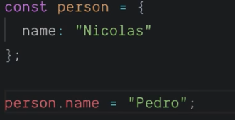

## Variables

#### 1.0 let and const

- const : **불변** // but const의 element는 변경 가능
  
- let : **가변** (기존의 var과 유사)

#### 1.1 var vs let,const : 기존 대비 가장 큰 차이점

1. temporal dead zone : var을 사용할 때 발생했던 **hoisting이 let에서는 불가능**. (ReferenceError발생)

- hoisting: when the program starts, the variables are "hoisted" to the top.

2. let과 const 모두 **block scope**

- scope: "bubble"→ dictated whether the variable is accessible or not.
- block scope: block ({}) 안에서 block 밖에 대한 접근은 가능.  block밖에서 block안에 대한 접근은 불가능.
- 기존의 var의 경우, function scope : function베이스였던 block을 모든 block기준으로 변경

#### 1.2 Conclusion : Using variables in Javascript

1. ~~var~~을 사용하지 않을 것.
2. **const** as a default
3. **let** as an option when it is necessary to override, modify or change
