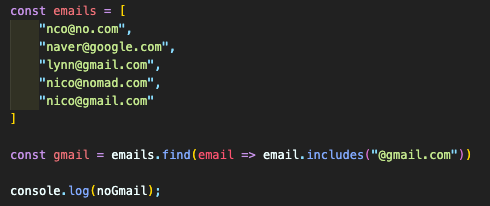

## Functions

#### 2.1 Arrow Functions

- Easy way to make function, easier way to read the code
- We used to write code like this
  
- Rewrite the code using arrow function
  1. function is replaced with =>
     
  2. brackets, semi-colon, return을 생략(implicit return)해서 더욱 간단하게 쓸 수 있다.
     
     - function의 body를 만들기 위해 bracket을 사용.
       bracket 사용시 return을 적어주지 않으면 "return nothing"이 됨.

#### 2.2 'this' in Arrow Functions

- Arrow Function의 this는 window object를 가리킴 (this가 특정 object를 가리키지 않음.)
- 아래의 사례처럼 this로 특정 object를 가리켜서 값을 변화시키고 싶을 때는 arrow function 사용 불가
  

#### 2.3 Arrow Functions in the Real World

- **Array.prototype.find()** (<a href="https://developer.mozilla.org/ko/docs/Web/JavaScript/Reference/Global_Objects/Array/find">Link</a>)
  주어진 판별 함수를 만족하는 첫 번째 요소의 값을 반환 → @gmail.com 을 포함하는 item을 찾는다.
  

- **Array.prototype.filter()** (<a href="https://developer.mozilla.org/ko/docs/Web/JavaScript/Reference/Global_Objects/Array/filter">Link</a>)
  주어진 함수의 테스트를 통과하는 모든 요소를 모아 새로운 배열로 반환
  

- **Array.prototype.forEach()** (<a href="https://developer.mozilla.org/ko/docs/Web/JavaScript/Reference/Global_Objects/Array/foreach">Link</a>)
  주어진 함수를 배열 요소 각각에 대해 실행
  
  - array를 반환해주는 **map함수**를 활용, 훨씬 간단하게 코딩이 가능
    
  - map함수를 통해 object를 return할 때, _implicit return은 {}밖을 ()으로 묶어 주면_ object를 return 가능
    

#### 2.4 Defalut Values

ES6의 function에 추가된 새로운 기능. 함수의 argument로서 default value를 지정할 수 있음.

