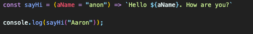
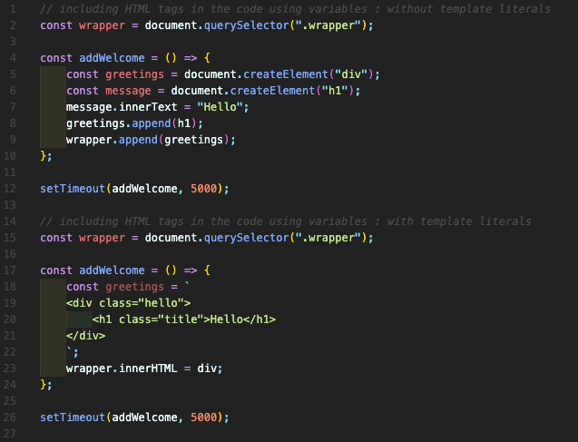
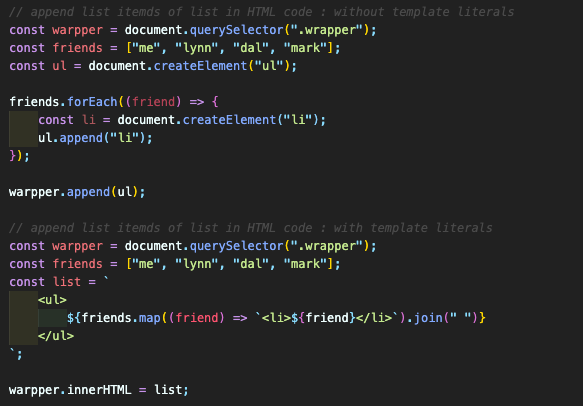
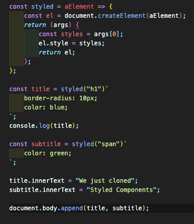
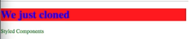
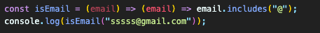
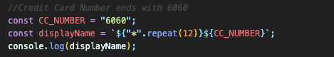
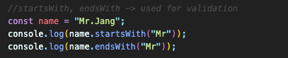

## Strings

#### 3.0 template literals( `` )

- Able to include variables in the middle of strings.
  

#### 3.1 HTML Fragments

- We can write HTML in JS using **template literals** and make long code shorter  
  Template literals respects line breaks and spaces
  
- Easier & simpler to write forEach statement using HTML
  

#### 3.2 Cloning Styled Components

- Styled components: library or packet for React that allow to write CSS in JS
- element와 css를 input으로 받아서 css를 적용한 element를 return하는 함수 작성
- React를 이해해야 잘 이해할 수 있음  
  
- result
  

#### 3.3 String methods

- **String.prototype.includes()** (<a href="https://developer.mozilla.org/ko/docs/Web/JavaScript/Reference/Global_Objects/String/includes">Link</a>)  
  하나의 문자열이 다른 문자열에 포함되어 있는지를 판별하고, 결과를 true 또는 false 로 반환.
  

- **String.prototype.repeat()** (<a href="https://developer.mozilla.org/ko/docs/Web/JavaScript/Reference/Global_Objects/String/repeat">Link</a>)  
  문자열을 주어진 횟수만큼 반복해 붙인 새로운 문자열을 반환.  
  

- **String.prototype.startsWith()** (<a href="https://developer.mozilla.org/ko/docs/Web/JavaScript/Reference/Global_Objects/String/startswith">Link</a>)  
  **String.prototype.endsWith()** (<a href="https://developer.mozilla.org/ko/docs/Web/JavaScript/Reference/Global_Objects/String/endswith">Link</a>)  
  어떤 문자열이 특정 문자로 시작/끝나는지 확인하여 결과를 true 혹은 false로 반환.
  
