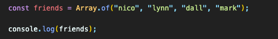
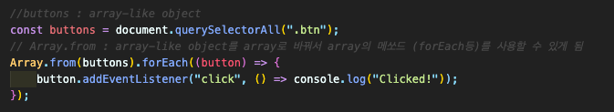
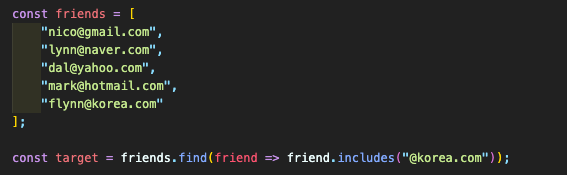
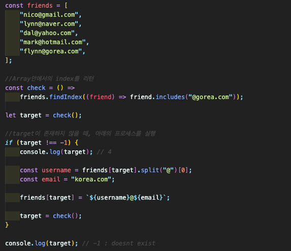
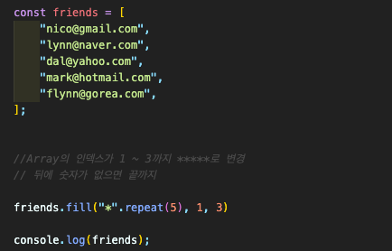

## Array

#### 4.0 Array methods

- **Array.of()** (<a href="https://developer.mozilla.org/ko/docs/Web/JavaScript/Reference/Global_Objects/Array/of">Link</a>)  
  인자의 수나 유형에 관계없이 가변 인자를 갖는 새 Array 인스턴스를 생성.  
  

- **Array.from()** (<a href="https://developer.mozilla.org/ko/docs/Web/JavaScript/Reference/Global_Objects/Array/from">Link</a>)  
  문유사 배열 객체(array-like object)나반복 가능한 객체(iterable object)를 얕게 복사해새로운Array 객체를 생성.  
  

- **Array.find()** (<a href="https://developer.mozilla.org/ko/docs/Web/JavaScript/Reference/Global_Objects/Array/find">Link</a>)  
  주어진 판별 함수를 만족하는 첫 번째 요소의 값을 반환. 그런 요소가 없다면 undefined를 반환.  
  

- **Array.findIndex()** (<a href="https://developer.mozilla.org/ko/docs/Web/JavaScript/Reference/Global_Objects/Array/findIndex">Link</a>)  
  주어진 판별 함수를 만족하는 배열의 첫 번째 요소에 대한 인덱스를 반환. 만족하는 요소가 없으면 -1을 반환.  
  

- **Array.fill()** (<a href="https://developer.mozilla.org/ko/docs/Web/JavaScript/Reference/Global_Objects/Array/fill">Link</a>)  
  배열의 시작 인덱스부터 끝 인덱스의 이전까지 정적인 값 하나로 채움.  
  
