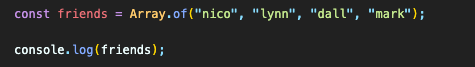
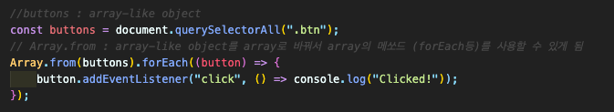

## Array

#### 4.0 Array methods

- **Array.of()** (<a href="https://developer.mozilla.org/ko/docs/Web/JavaScript/Reference/Global_Objects/Array/of">Link</a>)  
  인자의 수나 유형에 관계없이 가변 인자를 갖는 새 Array 인스턴스를 생성.  
  

- **Array.from()** (<a href="https://developer.mozilla.org/ko/docs/Web/JavaScript/Reference/Global_Objects/Array/from">Link</a>)  
  문유사 배열 객체(array-like object)나반복 가능한 객체(iterable object)를 얕게 복사해새로운Array 객체를 생성.  
  
