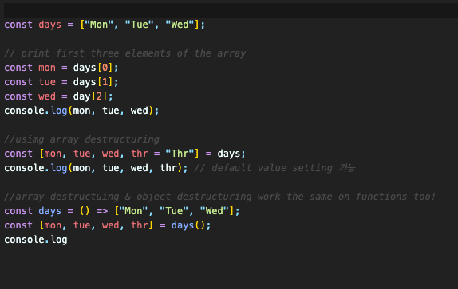

## Object Destructuring

#### 5.0 Object Destructuring

- To take variables outside of objects,arrays, etc.  
  

#### 5.1 Array Destructuring

- Useful when you dont have the control over the information
- {} to []
  

#### 5.2 Renaming

  

#### 5.3 Function Destructuring

- Use object destructuring on functions
- Good adding visibility on arguments of function
- Good at setting default values of functions  
  

#### 5.4 Value Shorthand (변수명 단축)

- 변수명과 변수의 키값이 동일할 때는 키값을 생략해도 됨  
  

#### 5.5 Swapping and Skipping

- Swapping: swap the values of variables using destructuring
- Skipping: skip unnecessary elements using destructuring

  
