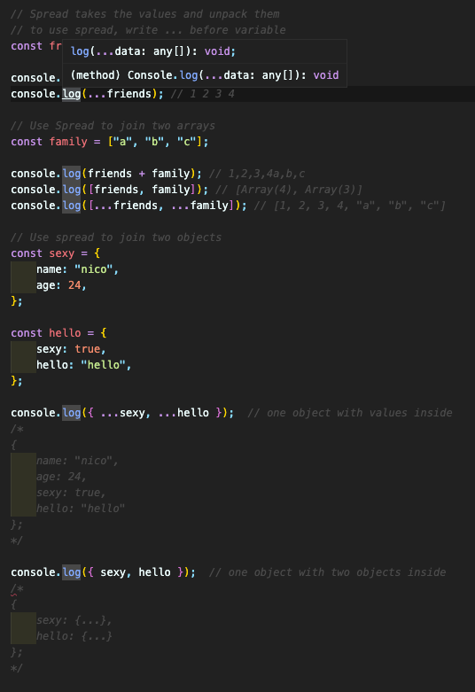
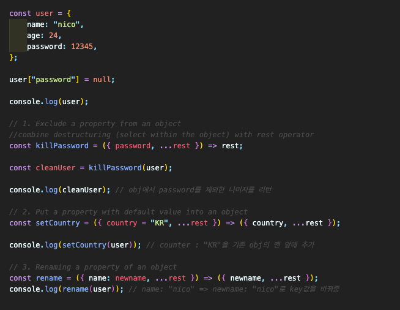

## REST and SPREAD

#### 6.0 Introduction to Spread

- Spread takes values and unpacks, expands them.  
  

#### 6.1 Spread Applications

- Adding / Merging / Updating arrays, objects...  
  

#### 6.2 Introduction to REST parameters

- parameters: things that we give to the function
- SPREAD : unpack variable => expand!
- REST : pack into a variable => contract!  
  

#### 6.3 REST + SPREAD + DESTRUCTURING application

- 1. Exclude a propety from an object
- 2. Put a property with the default value into the object
- 3. Rename the key of a property of an object  
     
