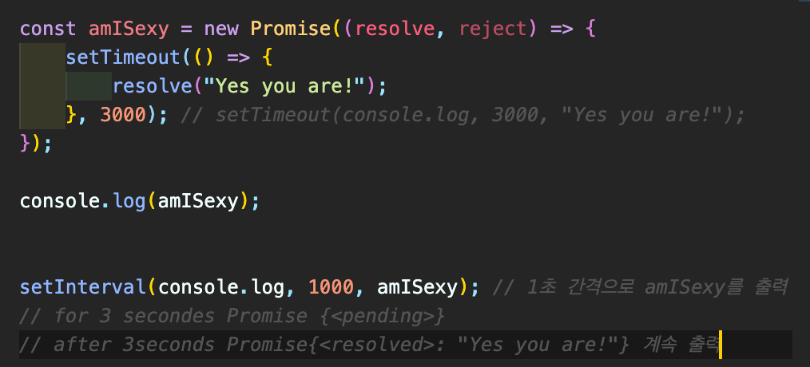
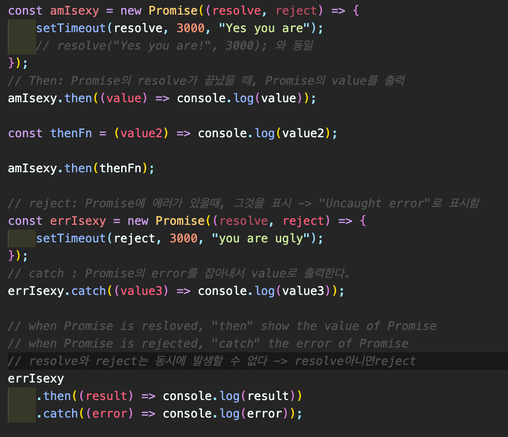
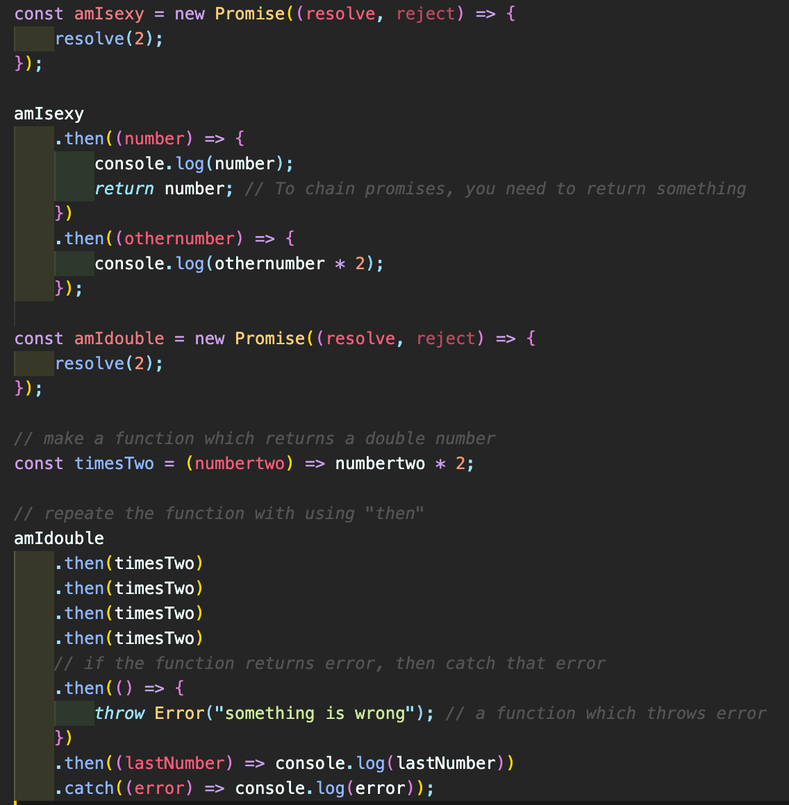
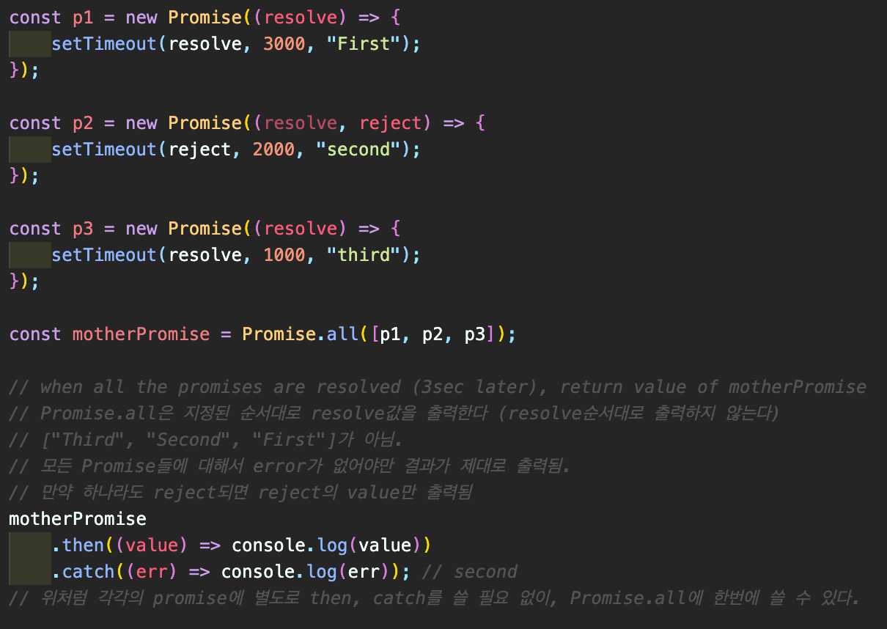
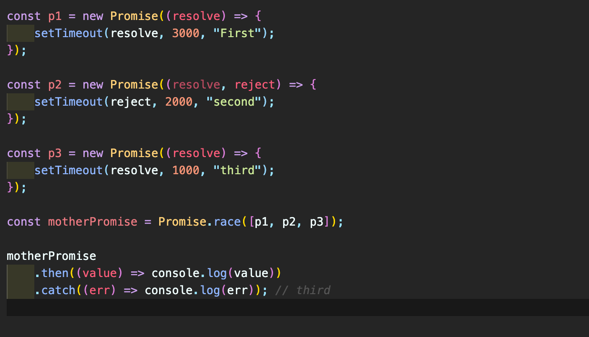
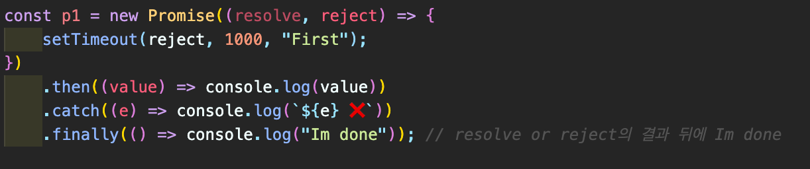

## Promises

#### 8.0 Introduction to Async

- Javascript program is, by default, **Asynchronous**  
  → Do things at the same time. Things don't happen one after another.  
  → One process does not stop another.  
  → 응답여부와 관계 없이 데이터를 전송할 수 있다.  
  → 전체 중 일부 데이터에 대해서만 갱신이 가능하다.

#### 8.1 Creating Promises

- Promise 객체는 비동기 작업이 맞이할 미래의 완료 또는 실패와 그 결과 값을 표시.
  (<a href="https://developer.mozilla.org/ko/docs/Web/JavaScript/Reference/Global_Objects/Promise">Link</a>)  
  → 어떤 작업이 끝났을때를 알려줌. (resolve: 제대로 된 결과 / reject: 에러)  
  

#### 8.2 Using Promises

- resolve → then / reject → error  
  

#### 8.3 Chaining Promises

- To chain Promises, you need to "return" something.
- If you don't return anything, next Promise cannot receive the value.  
  

#### 8.4 Promise.all

- Promise.all returns one promise that resolves when all the other promises have been resolved. (<a href="https://developer.mozilla.org/ko/docs/Web/JavaScript/Reference/Global_Objects/Promise/all">Link</a>)
- 모든 프로세스가 다 작동하고 있는지 확인할 때 유용하게 사용할 수 있다.  
  

#### 8.5 Promise.race

- Promise.race returns the value of a promise that resolves or rejects the fastest.
  (<a href="https://developer.mozilla.org/ko/docs/Web/JavaScript/Reference/Global_Objects/Promise/race">Link</a>)  
  

#### 8.6 .finally

- Promise가 처리(resolve/reject)되면 처리할 프로세스를 규정. (<a href="https://developer.mozilla.org/ko/docs/Web/JavaScript/Reference/Global_Objects/Promise/finally">Link</a>)  
  
