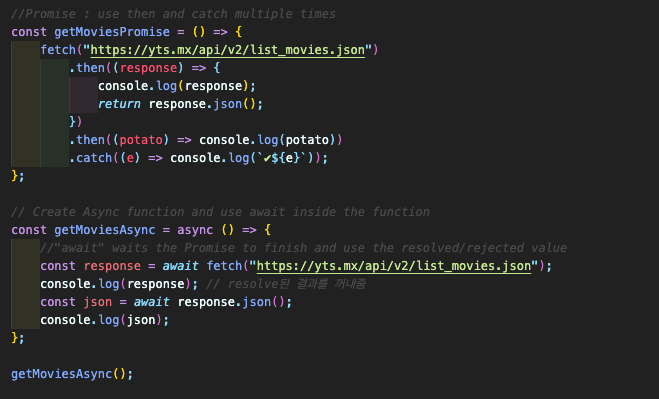
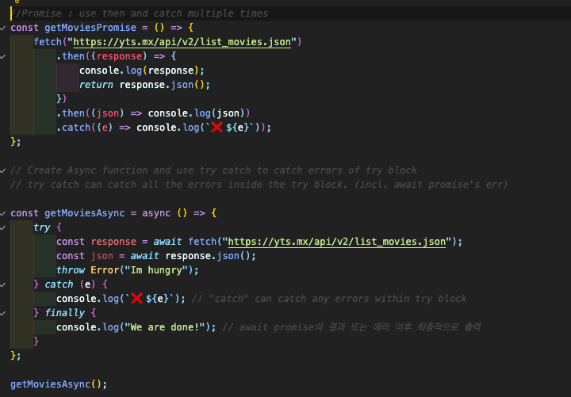
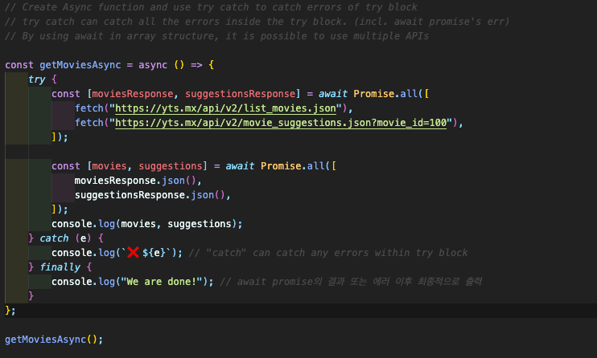

## Async, Await

#### 9.0 Async, Await

- Syntax working with promises to look better  
  (Save us from lots of ~~then~~, ~~catch~~, ~~function~~)  
  → 　 Ways to get values out of Promises **without using many thens and catches**
- **Await** : only able to use inside an **async function**
  

#### 9.1 Try Catch Finally

- Python의 예외처리 (try except finally)와 동일한 역할
- Why use async/await?: Clean code, Error handling, Conditionals, Intermediate values, Error stacks
- <a href="https://developer.mozilla.org/ko/docs/Web/JavaScript/Reference/Global_Objects/Promise/all">6 reasons to use Async and await</a>  
  

#### 9.2 Parallel Async Await

- Use Async, Await to get values out of Promises (Use multiple APIs)
- fetch를 해주는 많은 library들이 있으니 참고! **(예: axios)** (<a href="https://www.npmjs.com/package/axios">Link</a>)  
  
