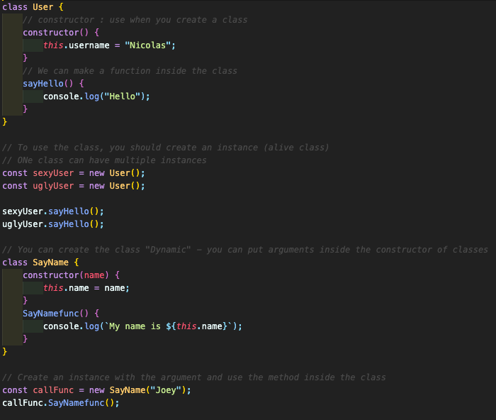
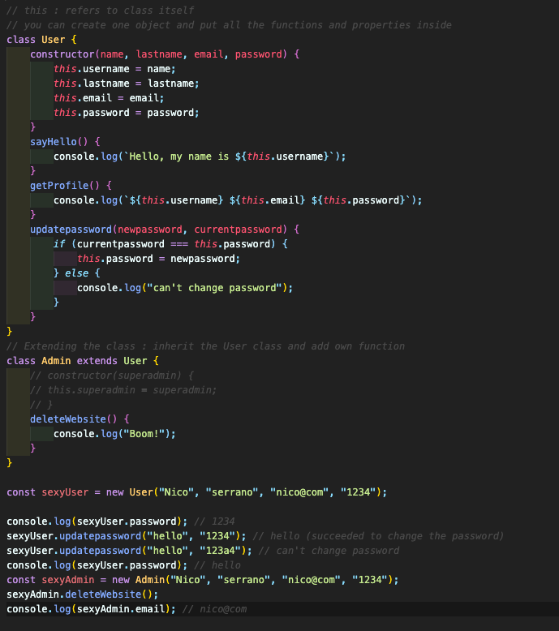
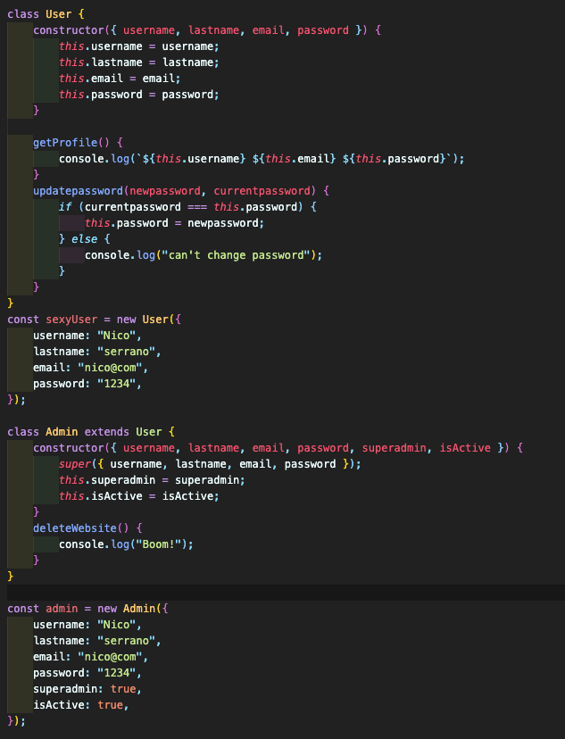
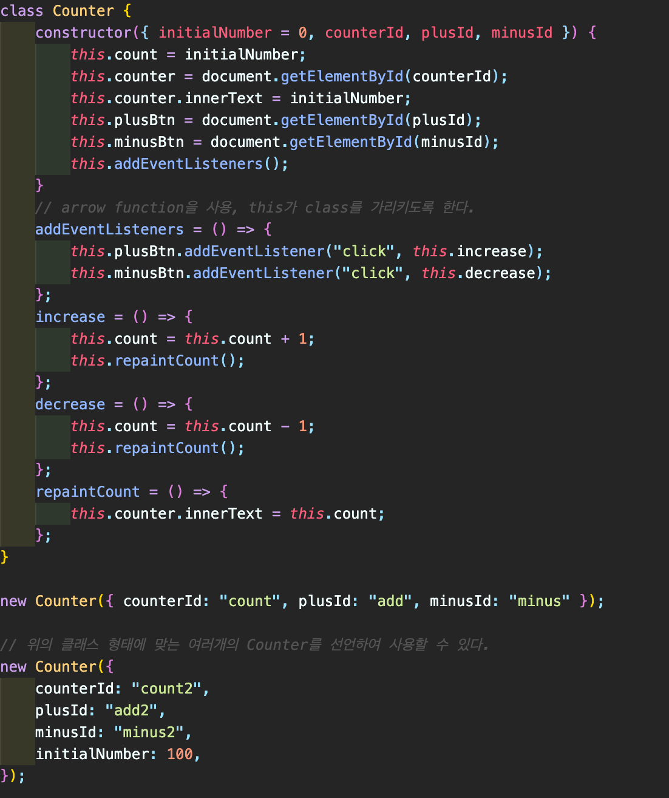

## Class

#### 10.0 Introduction to Classes

- Class: blueprint (설계도) → "fancy objects", "reusable", "factory of the object"
  

#### 10.1 Extending Classes

- this : refers to the whole class itself
- this의 사용은 class / function을 어떻게 정의하느냐에 따라서 달라질 수 있음
  

#### 10.2 super

- a function which is available only inside the class
- super는 base class의 constructor를 호출
- class를 활용해서 프로그램을 더 알기 쉽게 쓸 수 있다  
  

#### 10.3 About "this"

- 버튼에 대해 어떠한 이벤트를 할당하고, 해당 이벤트의 동작을 수행할 경우, this가 변경됨.  
  ex> When you add an eventlistener to the target,  
   　 the handler of that event will point "this" keyword to event target
- 클래스 안의 함수에 대해서 계속 this가 클래스를 가리키게 하려면?  
  → **클래스 안의 함수를 arrow-function으로 바꿔준다.**  
  
