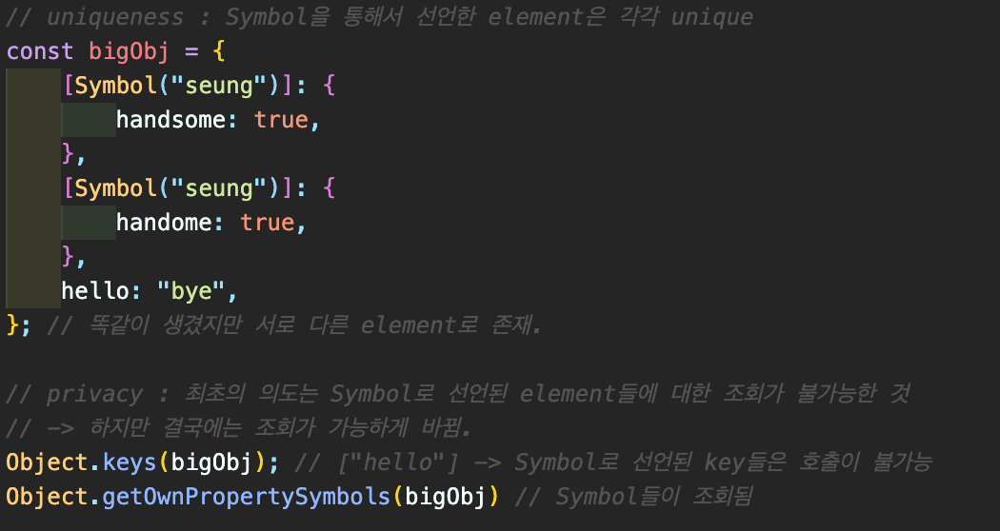

## ES6 - some other functions

#### 11.0 Symbols

- Symbols: a datatype that is supposed to be **unique**
- 선언: const hello = Symbol("hello");  
  (hello라는 decription을 가지는 Symbol을 const hello에 할당)
- 사용예: uniqueness / privacy  
  

#### 11.1 Sets

- set lets you store unique values or object references. **UNIQUE VALUES, NOT KEYS!** (<a href="https://developer.mozilla.org/ko/docs/Web/JavaScript/Reference/Global_Objects/Set/">Link</a>)
- 선언: const sep = new Set()
- **POWERFUL APIS**
  - has : Set에 특정 value가 있는지를 boolean으로 리턴 (<a href="https://developer.mozilla.org/ko/docs/Web/JavaScript/Reference/Global_Objects/Set/has">Link</a>)
  - delete : Set에서 특정 value를 삭제 (<a href="https://developer.mozilla.org/ko/docs/Web/JavaScript/Reference/Global_Objects/Set/delete">Link</a>)
  - add : Set에 특정 value를 추가 (<a href="https://developer.mozilla.org/ko/docs/Web/JavaScript/Reference/Global_Objects/Set/add">Link</a>)
  - clear : Set 안의 값을 전부 삭제 (<a href="https://developer.mozilla.org/ko/docs/Web/JavaScript/Reference/Global_Objects/Set/delete">Link</a>)
  - size : Set의 길이를 리턴 (<a href="https://developer.mozilla.org/ko/docs/Web/JavaScript/Reference/Global_Objects/Set/size">Link</a>)
  - keys : Set의 key값들을 iterator로 리턴 (<a href="https://developer.mozilla.org/ko/docs/Web/JavaScript/Reference/Global_Objects/Set/keys">Link</a>)

#### 11.2 WeakSet

- you can ~~only store objects~~ **No numbers, strings, arrays**
- only has ~~add/delete/has~~ as apis
- "Weak" Set : **Weakly held**  
   → WeakSet에 넣은 object가 외부에서 참조되지 않을 경우,  
  memory에서 지워진다.
  (Garbage collections: delete the stuff on the memories which is not being used.)

#### 11.3 Map, WeakMap

- **Set** is only about ~~values~~. **Map** is about both ~~keys and values~~. (<a href="https://developer.mozilla.org/ko/docs/Web/JavaScript/Reference/Global_Objects/Map/">Link</a>)
- 선언: const map = new Map() / map.set("age", 18)
- set과 마찬가지로 **다양한 api를 보유**, add는 불가능
- get: key에 대응하는 value를 추출 (<a href="https://developer.mozilla.org/ko/docs/Web/JavaScript/Reference/Global_Objects/Map/get">Link</a>)
- **WeakMap**: WeakSet과 마찬가지로 object만을 인수로 받을 수 있음

#### 11.4 Generators

- a function that you can pause (<a href="https://developer.mozilla.org/ko/docs/Web/JavaScript/Reference/Global_Objects/Generator/">Link</a>)
- generator를 사용하기 위한 format을 따라서 사용  
  
- usecases : **fetching data** - wait for the data and move on  
  → back of JS (generator의 기능을 하는 library 등)  
  ex> async await (basically a generator)

#### 11.5 Proxies

- like a filter, intercept the events of target object and execute defined event instead. (<a href="https://developer.mozilla.org/ko/docs/Web/JavaScript/Reference/Global_Objects/Proxy/">Link</a>)
- traps : proxyHandler's methods (<a href="https://developer.mozilla.org/en-US/docs/Web/JavaScript/Reference/Global_Objects/Proxy/Proxy">Link</a>)
  - handler.get() (<a href="https://developer.mozilla.org/en-US/docs/Web/JavaScript/Reference/Global_Objects/Proxy/Proxy/get">Link</a>) : a trap for getting a property value
  - handler.set() (<a href="https://developer.mozilla.org/en-US/docs/Web/JavaScript/Reference/Global_Objects/Proxy/Proxy/set">Link</a>) : a trap for setting a property value
  - handler.deleteProperty() (<a href="https://developer.mozilla.org/en-US/docs/Web/JavaScript/Reference/Global_Objects/Proxy/Proxy/deleteProperty">Link</a>) : a trap for delete ~~operator~~

 

- ES6의 Generator, Proxy를 대체하는 다른 library가 존재 (ex) Redux - Saga)

* **THINGS TO REMEMBER**  
  → arrow functions, destructuring, REST/spread, promises, async/await, classes
