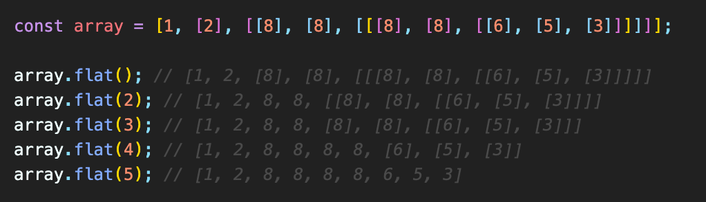

## ES6 - 2020 Update

#### 12.0 Nullish coalescing operator (??) : logical operator

- left-hand side = null or undefined → return right-hand side  
  (왼쪽이 null or undefine일때만 오른쪽을 출력)
  (<a href="https://developer.mozilla.org/en-us/docs/Web/JavaScript/Reference/Operators/Optional_chaining">Link</a>)
- OR (||) : left-hand side = **falsy value ('', 0)** → return right-hand side
  → **cannot return** the value **'', 0** even though they are usable values

#### 12.1 Optional Chaining (?.)

-　＆＆연산자를 사용해서 원래는 훨씬 길게 써야 했던 조건문을 **?** 를 사용해서 짧게 작성 가능 (<a href="https://developer.mozilla.org/ko/docs/Web/JavaScript/Reference/Operators/Nullish_coalescing_operator">Link</a>)  
 (next level will be called, if the previous level exists.)  
 

#### 12.2 padStart, padEnd

- Add padding at the beginning / end of the string

  - padStart (<a href="https://developer.mozilla.org/en-US/docs/Web/JavaScript/Reference/Global_Objects/String/padStart">Link</a>) : 앞에서부터 정해진 string을 채운다
  - padEnd (<a href="https://developer.mozilla.org/en-US/docs/Web/JavaScript/Reference/Global_Objects/String/padEnd">Link</a>) : 뒤에서부터 정해진 string을 채운다

- padStart, padEnd는 기존 variable의 value를 바꾸지는 않는다.  
  

#### 12.3 trim, trimStart, trimEnd

- Cut all the whitespaces from the beginning / end of the string

  - trim (<a href="https://developer.mozilla.org/en-US/docs/Web/JavaScript/Reference/Global_Objects/String/trim">Link</a>) : String의 앞&뒤의 whitespace를 없앤다
  - trimStart (<a href="https://developer.mozilla.org/en-US/docs/Web/JavaScript/Reference/Global_Objects/String/trimStart">Link</a>) : 앞에서부터 String에서 whitespace를 없앤다
  - trimEnd (<a href="https://developer.mozilla.org/en-US/docs/Web/JavaScript/Reference/Global_Objects/String/trimEnd">Link</a>) : 뒤에서부터 String에서 whitespace를 없앤다

- padStart, padEnd는 기존 variable의 value를 바꾸지는 않는다.

#### 12.4 Object entries, Object values, Object from Entries

- Object (<a href="https://developer.mozilla.org/en-us/docs/Web/JavaScript/Reference/Global_Objects/Object">Link</a>) : JS datatype to store various keyed collections and more complex entities.

  - Object.entries() (<a href="https://developer.mozilla.org/ko/docs/Web/JavaScript/Reference/Global_Objects/Object/entries">Link</a>) : 주어진 객체의 enumerable 속성을 [key, value]로 리턴  
    
  - Object.values() (<a href="https://developer.mozilla.org/ko/docs/Web/JavaScript/Reference/Global_Objects/Object/values">Link</a>): 주어진 객체의 value를 배열로 리턴
  - Object.fromEntries() (<a href="https://developer.mozilla.org/ko/docs/Web/JavaScript/Reference/Global_Objects/Object/fromEntries">Link</a>): key-value pair형태의 배열의 배열을 객체로 리턴

  

#### 12.5 Array flat

- Array.flat() (<a href="https://developer.mozilla.org/ko/docs/Web/JavaScript/Reference/Global_Objects/Array/flat">Link</a>) : 모든 하위 배열 요소를 지정한 깊이까지 재귀적으로 이어붙인 새로운 배열을 생성
- level 1 by default  
  

#### 12.6 Array sort

- Array.sort() (<a href="https://developer.mozilla.org/ko/docs/Web/JavaScript/Reference/Global_Objects/Array/sort">Link</a>) : 배열을 정렬 후 결과를 반환
- 정렬 시, **함수를 선언해서 그 결과대로 배열이 가능** ~~(compareFunction참조)~~
- 특히, **object안에서의 element들을 특정 조건대로 sorting할 때** 활용
- sort를 실행할 경우, **sort가 실행된 순서가 기존 obj의 정렬 순서에 반영됨**  
  

#### 12.7 Promise allSettled

- Promise.allSettled() (<a href="https://developer.mozilla.org/ko/docs/Web/JavaScript/Reference/Global_Objects/Promise/allSettled">Link</a>) : 나열된 Promise객체가 **모두 이행 / 모두 거부**되었을 때 대응하는 Promise객체를 반환
- 용도 : **1)서로 독립적인 Promise들을 동작시킬 때 사용** / **2)각각의 Promise의 동작 결과 확인 시 사용**
- cf> Promise.all() : **서로 dependend한 Promise들을 동작시킬 때 사용** (all succeed or fail)  
  
